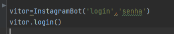
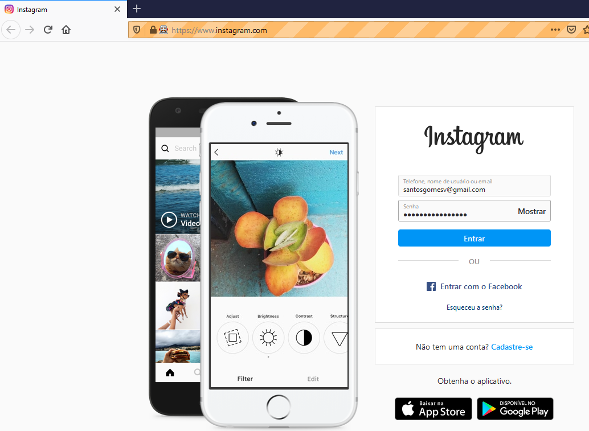

# Login automatico instagram

Para execultar o script e necessario possuir as seguintes libs
>from selenium import webdriver

importar o navegador
>from selenium.webdriver.common.keys import Keys

importar teclas
>import time
>import random

Apos intalado as bibliotecas basta preencher o campo login e senha de sua conta 

e execultar o scrip !

O script para na pagina home!

